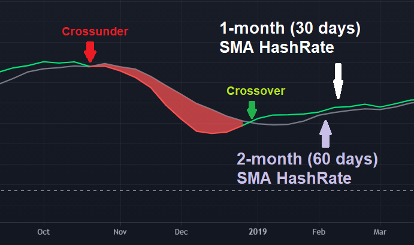
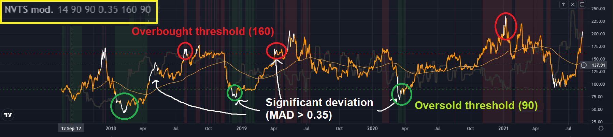

### Cryptocurrency Algorithmic Trading
HKU Fintech Competition
  

# <ins> 4.6 On-chain analysis (Optional) <ins/>

This module is optional as on-chain analysis is for long term trading, which is not suitable for the competition. However, for those who want to dig deeper into the techniques of cryptocurrency trading, this module can help you learn about on-chain analysis, an unique type of fundamental analysis specific to cryptocurrencies.

## A brief recap
From [Module 0.2.2: Technical Analysis vs Fundamental Analysis of Cryptocurrencies](<../Module 0 - Introduction/README.md>):

> Technical Analysis focuses exclusively on **price** and **does not pay much attention to fundamentals**. For cryptocurrencies, fundamental factors include things like **tokenomics**, **network activity**, **the strength of the project’s development team**, and any **notable partnerships** the project has. These fundamentals are often used by HODLers and more experienced traders to gauge the long-term price potential of an asset.

> Given that the average cryptocurrency trader is **irrational**, many believe that technical analysis is more effective than fundamental analysis for this reason. As a rule of thumb, **technical analysis** should be **used for shorter term trading** whereas **fundamental analysis** should be used for **long term trading**. A combination of both is necessary to ensure a clear picture of the cryptocurrency you are trading.

Cryptocurrencies based on public blockchains which record every on-chain transaction ever made allow for the extraction of investor behavior from huge data sets via their public ledgers.
- [Interdax - How can on-chain analysis help cryptocurrency traders?](https://medium.com/interdax/how-chain-analysis-helps-cryptocurrency-traders-dd4de03f823)

By grouping and analyzing publicly available blockchain data, the behaviour or motivations of market participants over time can be studied. As Coupling blockchain data with Price data provides useful long-term forecasting tools.

On-chain analysis crucial for investors in separating a cryptocurrency's speculative potential from its practical value. Whether a cryptocurrency's price is justified by the fundamentals could be judged by examining, for instance, network value and miner activity using blockchain data.

In this module, we will go over Hash Rate and Network Value of Bitcoin and how they are used to create trading strategies. The code for implementing these algorithms on QC are also linked in this tutorial.

## Pre-requisites
- [Module 0.1: What is a cryptocurrency?](<../Module 0 - Introduction/README.md>)
- [Module 0.2.2: Technical Analysis vs Fundamental Analysis of Cryptocurrencies](<../Module 0 - Introduction/README.md>)
- [Module 4.1 Moving Average Trend Following](https://github.com/TonyTang1997/hku-crypto-algo-trading-research/blob/main/tutorials/Module%204%20-%20Trading%20Strat/Module_4.1_Moving_Average_Trend_Following.md)

## Estimated Time to Finish:
1 - 1.5 hour (excluding Optional Materials)

## Main Learning Objectives:
- Understanding on-chain analysis as one of the fundamental factors of the cryptocurrency market
- Learning about the Hash Rate Capitulation Ribbon indicator
- Learning about the Network-Value-Transaction (NVT) Signal indicator

---

## 4.6.1 Hash Rate Capitulation Ribbon

### Hash Rate

Bitcoin hash rate (also hashrate) is a measure of the computational power of the Bitcoin network.
- [BitcoinWiki - Hashrate (hashing power or h/s)](https://en.bitcoinwiki.org/wiki/Hashrate)
- For this stratetgy, the source of historical hashrate data is provided by [Quandl](https://www.quandl.com/data/BCHAIN/HRATE-Bitcoin-Hash-Rate)

It is the speed at which the Bitcoin network processes data when adding new transactions to the shared ledger.

The hash rate of all Bitcoin mining computers has long been a helpful indicator for determining the network's size and power. It shows how much computational power is committed to processing and recording transactions on the Bitcoin ledger.

As of July 01, 2021, Bitcoin hashrate is around 90 EH/s, and achieved an all time high on May 09, 2021 at block 682,804 of 224.02 EH/s (2.2402 ⋅ 10²⁰ hashes per second) according to the [source from Coinwarz](https://www.coinwarz.com/mining/bitcoin/hashrate-chart)

### The Relationship between Price and Hash Rates

Miners abandon Bitcoin and capitulate when mining is no longer profitable, and they put their computer prowess to better use elsewhere or sell their equipment. This can be attributed to one of two reasons: a declining Bitcoin price or rising operating costs (namely electricity).

As a result, the price of Bitcoin and the hash rate are inextricably intertwined. Hash rates have soared in response to price peaks in Bitcoin, then bottomed out as miners leave. Afterwards, their upward climb is resumed.

### The Hash Rate Capitulation Ribbon Strategy

Buying Bitcoin during a phase of “miner capitulation” is advantageous due to the effect of negative sentiment and price action during deep bear markets and times of such phase.
- [Charles Edwards - Hash ribbons & bitcoin bottoms.](https://medium.com/capriole/hash-ribbons-bitcoin-bottoms-60da13095836)

An 1- and 2-month simple moving average (SMA) of Bitcoin’s Hash Rate can be used to identify market bottoms, miner capitulation and opportunity to buy Bitcoin at a low price.

When the 1-month Hash Rate SMA crosses over its 2-month counterpart, the worst of the miner capitulation is typically over, marking the beginning of recovery.

In order to eliminate drawdowns, Bitcoin 10- and 20-day close price SMA crossover is added as a price action indicator for generating buy signals as miners start to recover.

This strategy is also applicable for other [Proof-of-Work] cryptocurrencies (e.g ETH 1.0, LTC)
- [Litecoin (LTC) Hashrate - BitinfoCharts](https://bitinfocharts.com/comparison/litecoin-hashrate.html)
- [Ethereum (ETH) Hashrate - CoinWarz](https://www.coinwarz.com/mining/ethereum/hashrate-chart)
  - As of July 2021, [ETH 2.0](https://ethmerge.com/) has not yet been released yet. However, ETH will be using [Proof-of-Stakes](https://finematics.com/ethereum-2-0-explained/) as the consensus mechanism instead after the upgrade, rendering the hashrate strategy obsolete for ETH.

#### Link to code and video

This is the [link to the code](https://github.com/TonyTang1997/hku-crypto-algo-trading-research/blob/main/algos/onchain_analysis/hashRateRibbon.py) for the implementation of Hash Rate Capitulation Ribbon in QuantConnect.

This [video](https://drive.google.com/file/d/1xbuRJwfPFm_0ftpK903TIOtugjmHuATg/view?usp=sharing) will walk you through the code and help you understand the logic behind the strategy.

---

## 4.6.2 Network-Value-Transaction (NVT) Signal

### Standard NVT Ratio

NVT was proposed by [Willy Woo in 2017](https://woobull.com/introducing-nvt-ratio-bitcoins-pe-ratio-use-it-to-detect-bubbles/)  as a proxy assessment for Bitcoin's network's underlying utility. The NVT Ratio (Network Value to Transactions Ratio) is analogous to the P/E Ratio used in equities markets.

- For the algorithm of this part, the source of historical [Bitcoin Estimated Transaction Volume USD](https://www.quandl.com/data/BCHAIN/ETRVU-Bitcoin-Estimated-Transaction-Volume-USD) and # [Bitcoin Market Capitalization](https://www.quandl.com/data/BCHAIN/MKTCP-Bitcoin-Market-Capitalization) data is provided by [Quandl](https://www.quandl.com/data/BCHAIN/)

****

Bitcoin's NVT ratio is calculated by dividing the Network Value (NV) (Market Capitalization) by the daily USD Transaction Volume transmitted through the blockchain (TV) and then smoothed out using a 2-week moving average or median.

This is the same as dividing the bitcoin token supply by the daily BTC value sent on the blockchain.

When Bitcoin's NVT is high, it means the network's value is outstripping the value being sent over its payment network. This happens when the network is growing rapidly and investors see it as a high-return investment, or when the price is in an unsustainable bubble.

This metric is also applicable for other cryptocurrencies with a public ledger.

### NVT Signal

****

[Dmitry Kalichkin](<(https://medium.com/cryptolab/https-medium-com-kalichkin-rethinking-nvt-ratio-2cf810df0ab0)>) proposed a more responsive version of NVT as an indicator in 2018 by applying the moving average just to the volatile Transactions component only without smoothing the already stable Network Valuation component, hence Kalichkin NVT Signal (NVTS).

NVT Signal can be used as an oscillator. At the inception of the indicator, Bitcoin was considered overbought when NVTS was above 150. When it was below 60, it was considered oversold. However, since Mar 2018, NVTS of bitcoin has never dropped below 60. As a result, NVTS has often over-signaled bearish and failed to signal bullish as strongly as it previously has In the last few years.

### Modified NVTS Indicator

****

To further improve NVTS, the absolute difference between NVTS and its 90-day Running Moving Average (RMA) is measured to detect significant deviation. Note that RMA is just an EMA with a stronger weight for recent values (where α = 1/N)

- Forgot what is an EMA? please refer back to [Module 4.1 Moving Average Trend Following](https://github.com/TonyTang1997/hku-crypto-algo-trading-research/blob/main/tutorials/Module%204%20-%20Trading%20Strat/Moving%20Average%20Trend%20Following.md)

The deviation is considered significant when it is above 0.35. A long position is entered when NVTS is above the overbought threshold (160) and there is a significant deviation. Similarly, the position is closed when NVTS is below the oversold threshold (90) and the deviation is significant.

#### Link to code and video

The is the [link to the code](https://github.com/TonyTang1997/hku-crypto-algo-trading-research/blob/main/algos/onchain_analysis/nvts.py) for the implementation of modified NVTS strategy in QuantConnect.

This [video](https://drive.google.com/file/d/1eYvklEqCDjRoB3nhHJhHbVmSJopQswA8/view?usp=sharing) will walk you through the code and help you understand the logic behind the strategy.

---

## Optional Resources

[Look Into Bitcoin](https://www.lookintobitcoin.com/charts/)
- free insightful Bitcoin valuation tools, with market cycle and on-chain data charts

[Glassnode](https://glassnode.com/)
- An on-chain market indicators site, showing a wide variety of data for Bitcoin and Ethereum.

[Willy Woo's website](https://woobull.com/)
-  free in-depth on-chain demand/supply analysis and research articles

---

## Next Up:

Congratulations! You have finished the entire learning series. Now it is time for you to design and implement your own strategy on QuantConnect and put what you have learnt so far into practice.

---

## References

- [BitcoinWiki - Hashrate (hashing power or h/s)](https://en.bitcoinwiki.org/wiki/Hashrate)

- [Quandl - Bitcoin Blockchain Data](https://www.quandl.com/data/BCHAIN/)

- [CoinWarz - Bitcoin hashrate chart.](https://www.coinwarz.com/mining/bitcoin/hashrate-chart)

- [BitinfoCharts - Litecoin (LTC) Hashrate](https://bitinfocharts.com/comparison/litecoin-hashrate.html)

- [CoinWarz - Ethereum (ETH) Hashrate](https://www.coinwarz.com/mining/ethereum/hashrate-chart)

- [ETH 2.0 merge](https://ethmerge.com/)

- [Finematics - Eth 2.0 and Proof-of-Stakes explained](https://finematics.com/ethereum-2-0-explained/)

- [Charles Edwards - Hash ribbons & bitcoin bottoms.](https://medium.com/capriole/hash-ribbons-bitcoin-bottoms-60da13095836)

- [EthHub - Zk-rollups.](https://docs.ethhub.io/ethereum-roadmap/layer-2-scaling/zk-rollups/) .

- [Interdax - How can on-chain analysis help cryptocurrency traders?](https://medium.com/interdax/how-chain-analysis-helps-cryptocurrency-traders-dd4de03f823)

- [Dmitry Kalichkin - Rethinking network value to transactions (nvt) ratio.](https://medium.com/cryptolab/https-medium-com-kalichkin-rethinking-nvt-ratio-2cf810df0ab0)

- [lightning.network - The bitcoin lightning network: Scalable off-chain instant payments.](https://lightning.network/lightning-network-paper.pdf)

- [Willy Woo - Introducing nvt ratio (bitcoin’s pe ratio), use it to detect bubbles.](https://woobull.com/introducing-nvt-ratio-bitcoins-pe-ratio-use-it-to-detect-bubbles/)
